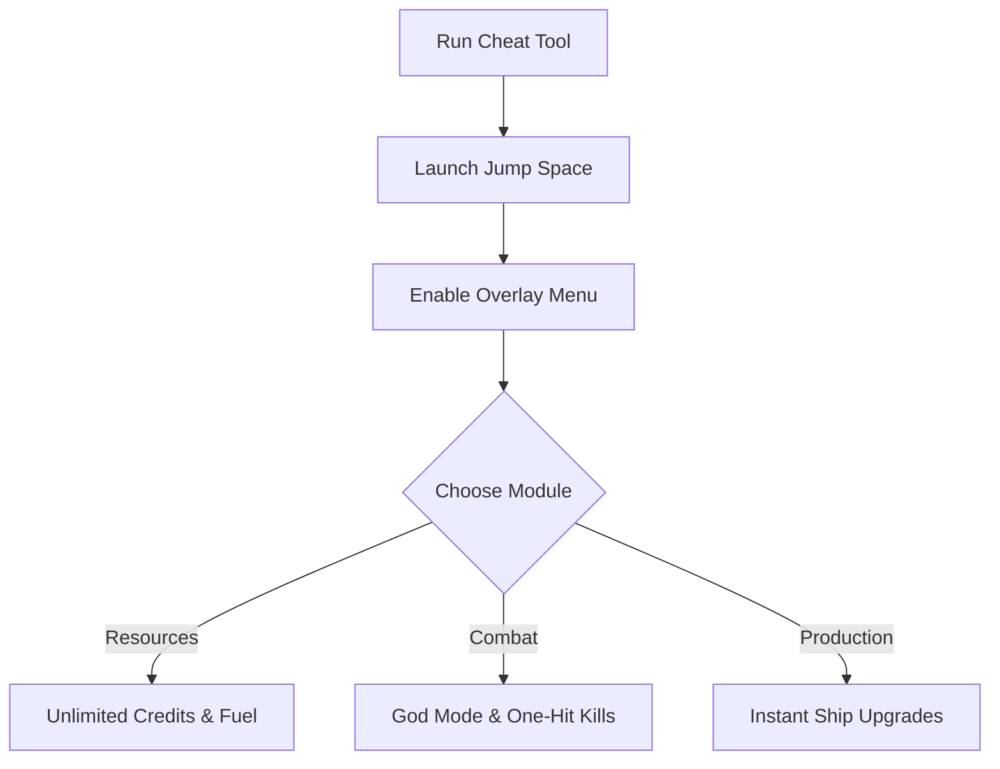

# Jump Space Cheat 🚀

The **Jump Space Cheat Software** is made for players who want to expand beyond the game’s built-in limits. With **resource boosters, god mode fleets, and instant construction tools**, it transforms Jump Space into a sandbox of experimentation and power.

---

## 📝 Overview

Jump Space is all about exploration and survival among the stars, but grinding for resources and upgrading ships can slow progression. This cheat package gives you **unlimited fuel, instant ship builds, and invincible combat power**, so you can focus on strategy and creativity.

\[!IMPORTANT]
The cheat runs in memory only. Your save files and game data remain safe unless you intentionally overwrite them.

[](#)
[](#)
[](#)
[](#)


---

## ⭐ Features

* **Unlimited Resources** – Maximize credits, fuel, and crafting items.
* **God Mode Ships** – Survive battles without taking damage.
* **Instant Builds** – Complete ships, upgrades, and stations instantly.
* **One-Hit Kills** – Wipe out enemies with a single strike.
* **Overlay Menu** – Enable or disable cheats live in-game.
* **Custom Profiles** – Save unique setups for exploration, farming, or combat runs.

---

## 🖥 Compatibility

| Platform       | Supported | Notes              |
| -------------- | --------- | ------------------ |
| Windows 10/11  | ✅         | Fully supported    |
| Steam          | ✅         | Stable integration |
| Linux (Proton) | ⚠️        | Limited testing    |
| Consoles       | ❌         | Not supported      |

\[!NOTE]
Accessibility: Overlay supports large-text scaling, high-contrast mode, and simplified HUD options for easier use.

---

## ⚡ Setup Guide

1. **Download** the Jump Space Cheat package.
2. Extract into your Jump Space install directory.
3. Run `JumpSpace_Cheat.exe` as administrator.
4. Start the game and press `F1` to activate the overlay.
5. Adjust settings in-game or through `config.ini`.

```ini
[cheat]
resources=unlimited
godmode=true
instant_builds=true
one_hit_kills=false
```

---

## 🔄 Cheat Workflow



---

## ❓ FAQ

**Q: Does this affect campaign progression?**
A: No, story events remain unchanged.

**Q: Can I toggle features mid-mission?**
A: Yes, everything can be switched instantly.

**Q: Will it damage my saves?**
A: No, unless cheats are saved on purpose.

**Q: Is it usable in multiplayer?**
A: No, it is designed for **single-player only**.

**Q: Can I use multiple configs?**
A: Yes, profiles allow setups for combat, farming, or exploration.

---

## 🚀 Final Thoughts

The **Jump Space Cheat Software** gives you complete freedom over your galactic journey. With **unlimited resources, instant construction, and invincible fleets**, you can test strategies, enjoy exploration, or dominate the stars your way.

---
